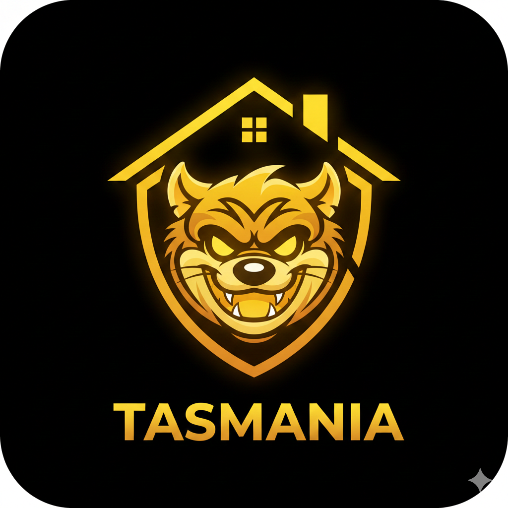

```
 ████████╗ █████╗ ███████╗███╗   ███╗ █████╗ ███╗   ██╗██╗ █████╗
 ╚══██╔══╝██╔══██╗██╔════╝████╗ ████║██╔══██╗████╗  ██║██║██╔══██╗
    ██║   ███████║███████╗██╔████╔██║███████║██╔██╗ ██║██║███████║
    ██║   ██╔══██║╚════██║██║╚██╔╝██║██╔══██║██║╚██╗██║██║██╔══██║
    ██║   ██║  ██║███████║██║ ╚═╝ ██║██║  ██║██║ ╚████║██║██║  ██║
    ╚═╝   ╚═╝  ╚═╝╚══════╝╚═╝     ╚═╝╚═╝  ╚═╝╚═╝  ╚═══╝╚═╝╚═╝  ╚═╝
```

<p align="center">
  
</p>

<p align="center">
  Run local LLMs easily — batteries included.
</p>

<p align="center">
  <a href="https://github.com/mbaril010/tasmania/releases/latest">Download</a> ·
  <a href="#features">Features</a> ·
  <a href="#mcp-integration">MCP Integration</a> ·
  <a href="#development">Development</a>
</p>

---

Tasmania is a self-contained macOS desktop app for running local LLMs. It bundles `llama-server` (from [llama.cpp](https://github.com/ggml-org/llama.cpp)), provides a built-in model browser for Hugging Face, and exposes an MCP server so Claude Code can talk to your local models.

No Python. No Docker. No CLI setup. Just download, open, and run.

## Features

- **Bundled llama.cpp** — `llama-server` is downloaded automatically on `npm install`. No external dependencies required.
- **Hugging Face Model Browser** — Search, browse, and download GGUF models directly from Hugging Face without leaving the app.
- **One-Click Server** — Select a model and start an OpenAI-compatible API server with a single click.
- **GPU Acceleration** — Full Metal support on Apple Silicon. Configure GPU layers, context size, and port from Settings.
- **MCP Server for Claude Code** — Expose your local LLMs to Claude Code via the Model Context Protocol.
- **Auto-Update Checker** — Checks GitHub Releases for new versions on launch (configurable in Settings).

## Installation

### Download

Grab the latest `.dmg` from [Releases](https://github.com/mbaril010/tasmania/releases/latest), open it, and drag Tasmania to your Applications folder.

> **Note**: Tasmania is not code-signed or notarized. On first launch, right-click the app and select "Open" to bypass Gatekeeper, then click "Open" in the dialog.

### Requirements

- macOS (Apple Silicon or Intel)
- ~200 MB disk space for the app + space for your models

## MCP Integration

Tasmania includes an MCP server that lets Claude Code interact with your local models. Add this to your Claude Code MCP configuration:

```json
{
  "mcpServers": {
    "tasmania": {
      "command": "node",
      "args": ["/Applications/Tasmania.app/Contents/Resources/dist-mcp/server.js"]
    }
  }
}
```

You can also copy this config from **Settings > Claude Code MCP Integration** in the app.

### MCP Tools

| Tool | Description |
|------|-------------|
| `query_llm` | Send a prompt to the running local LLM |
| `list_models` | List all locally available GGUF models |
| `load_model` | Load a model and start the server |
| `get_server_status` | Check if the server is running and which model is loaded |
| `download_model` | Download a GGUF model from Hugging Face |

### MCP Resources

| Resource | Description |
|----------|-------------|
| `tasmania://models/active` | Info about the currently loaded model |
| `tasmania://models/available` | List of local GGUF models |
| `tasmania://logs/server` | Recent server output logs |

## Development

### Prerequisites

- Node.js 18+
- npm

### Setup

```bash
git clone https://github.com/mbaril010/tasmania.git
cd tasmania
npm install    # also downloads llama-server via postinstall
```

### Run

```bash
npm start
```

### Build

```bash
# Package the app
npm run package

# Create .dmg installer
npm run dmg
```

### Project Structure

```
src/
├── main/                   # Electron main process
│   ├── ipc/                # IPC handlers (backend, model, system, update)
│   ├── mcp/                # MCP server + control API (localhost:3999)
│   ├── services/           # BackendService, LlamaCppBackend, ProcessManager,
│   │                       # HuggingFaceService, ModelService, UpdateService
│   └── store/              # electron-store persistence
├── renderer/               # React UI
│   ├── screens/            # Home, Models, Backends, Settings
│   ├── contexts/           # AppContext (global state)
│   └── components/         # Reusable UI components
├── shared/                 # Types, constants, IPC channel definitions
scripts/
├── download-llama.sh       # Downloads llama-server binary on npm install
└── create-dmg.sh           # Creates .dmg installer using hdiutil
landing/                    # Next.js landing page (separate app)
```

### Tech Stack

- **Electron Forge** + **Vite** + **TypeScript**
- **React 19** with inline styles
- **electron-store** for settings persistence
- **@modelcontextprotocol/sdk** for MCP server
- Pure `fetch()` for Hugging Face API and GitHub API (no extra dependencies)

## License

MIT
